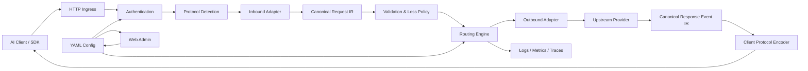

# AI Router 完整构建计划

> 文档状态：可执行基线  
> 项目定位：精简、精致、配置优先、带 Web 控制台的 AI 协议转换与路由工具  
> 参考项目：`claude-code-router/`  
> 推荐实现语言：Go  

## 1. 文档目标

本文档定义 AI Router 从零构建到正式可交付版本的完整计划，包括产品边界、技术架构、协议兼容范围、配置格式、管理网页、工程结构、安全要求、测试策略、实施阶段和最终验收标准。

项目最终必须达到以下效果：

- 无需安装或运行桌面软件。
- 一个二进制文件即可启动网关与 Web 管理页面。
- 使用一个 YAML 配置文件完成全部核心配置，并支持环境变量注入密钥。
- Web 页面可以查看、验证和修改同一份配置，不形成第二套配置源。
- 在 OpenAI Chat Completions、OpenAI Responses、Anthropic Messages 和 Gemini Generate Content 之间进行可靠的请求、响应及流式事件转换。
- 支持模型映射、条件路由、多目标 Fallback、超时、重试、鉴权和可观测性。
- 对无法无损转换的字段给出明确诊断，不静默制造错误语义。
- 可在 macOS、Linux、Windows 和 Docker 中部署。
- 保持小而清晰，不演化成桌面客户端、Agent 启动器或供应商运营平台。

## 2. 产品定义

### 2.1 一句话定义

AI Router 是一个位于 AI 客户端和模型 Provider 之间的轻量协议网关：它接收客户端熟悉的 API，转换成上游支持的协议，并通过配置完成模型路由、容错和观测。

### 2.2 目标用户

- 同时使用多个模型 Provider 的个人开发者。
- 需要让 Claude Code、Codex、OpenAI SDK、Anthropic SDK 或自研 Agent 复用统一入口的团队。
- 需要在不修改业务代码的情况下切换模型或供应商的服务端项目。
- 需要验证不同 AI API 协议兼容性的开发者。

### 2.3 核心使用方式

```bash
# 启动服务
airoute serve --config ./airoute.yaml

# 校验配置
airoute check --config ./airoute.yaml

# 打开管理页面
airoute ui

# 诊断运行环境和 Provider
airoute doctor
```

客户端只需将 Base URL 指向 AI Router：

```text
http://127.0.0.1:12666/v1/chat/completions
http://127.0.0.1:12666/v1/responses
http://127.0.0.1:12666/v1/messages
http://127.0.0.1:12666/v1beta/models/{model}:generateContent
```

### 2.4 产品原则

1. **单一职责**：核心只解决协议转换、路由和可靠转发。
2. **配置优先**：配置文件是唯一事实来源，Web 是它的可视化控制面。
3. **单二进制交付**：前端静态资源嵌入服务端，无额外运行时依赖。
4. **显式兼容**：任何有损转换都必须可观察、可配置、可测试。
5. **默认安全**：管理端默认只监听本机，密钥不写日志，公网管理必须鉴权。
6. **渐进增强**：先保证核心协议正确，再增加供应商便利功能。
7. **避免特例污染**：供应商差异放入独立 Profile/Quirk 层，不侵入通用协议 IR。

## 3. 范围与非目标

### 3.1 必须实现

- OpenAI Chat Completions 入站和出站适配。
- OpenAI Responses 入站和出站适配。
- Anthropic Messages 入站和出站适配。
- Gemini Generate Content 入站和出站适配。
- 非流式与 SSE 流式转换。
- 文本、图片、Tool Calling、Tool Result、结构化输出、usage 和 stop reason 转换。
- Provider、模型映射、路由、Fallback、重试和超时。
- 入站 API Key 鉴权与管理端鉴权。
- 配置校验、热加载、原子保存和回滚。
- Web 状态页、Provider、路由、Playground、日志和设置页面。
- CLI 校验、探测、诊断和离线转换命令。
- Docker 与三大桌面/服务器平台二进制发行。

### 3.2 明确不做

- Electron 或其他桌面壳。
- 托盘程序、开机启动、自动修改系统代理。
- 自动修改 Claude Code、Codex 或其他客户端的本地配置。
- HTTPS 中间人、证书签发和网络抓包。
- Bot 网关、聊天平台接入。
- MCP Hub、浏览器自动化、搜索融合模型。
- 供应商余额、套餐运营、支付或账号中心。
- 第一版插件市场和任意代码插件。
- 分布式控制面、多租户计费平台。

这些能力只有在核心稳定且存在明确用户需求时，才能作为独立扩展项目评估，不能直接并入核心。

## 4. 对参考项目的取舍

### 4.1 借鉴内容

- Provider 与 Route 分离的配置思路。
- OpenAI、Anthropic、Gemini 多协议入口。
- 模型映射、API Key 轮换和失败降级。
- Provider 协议探测和连通性检查。
- Web 管理端的 Host、Origin 与 Token 防护。
- 请求日志、用量统计和状态诊断。

### 4.2 重新设计内容

- 不复用 Electron、Agent、Proxy、Bot、MCP 等外围模块。
- 不让 SQLite 成为主配置源；YAML 始终是唯一事实来源。
- 不依赖隐藏的外部网关进程；协议转换在本项目核心内完成。
- 不把路由、协议特例、日志和进程管理堆进单个超大 Service 文件。
- 不沿用历史字段别名堆叠；配置从第一天就有版本和 JSON Schema。

### 4.3 代码复用原则

参考项目用于理解行为与功能，不默认复制实现。若复用任何代码，必须先确认许可证、依赖许可证、版权声明和代码来源，并为复用部分保留必要声明。协议适配层优先重新实现并使用公开 API 文档及测试夹具验证。

## 5. 技术选型

### 5.1 服务端：Go

选择 Go 的原因：

- 可生成无外部运行时依赖的单二进制文件。
- HTTP、SSE、流式 IO、取消传播和并发模型成熟。
- 适合网关型常驻进程，内存与部署成本低。
- `embed` 可把 Web 静态资源嵌入二进制。
- 易于交叉编译 Linux、macOS、Windows 和多种 CPU 架构。

建议基线：

- Go 1.24 或项目开始时稳定的最新版本。
- 标准库 `net/http` 为主，避免引入重型 Web 框架。
- YAML：`gopkg.in/yaml.v3`。
- JSON Schema：选择维护活跃且可离线校验的轻量库。
- 日志：`log/slog`。
- 指标：Prometheus 文本格式，核心逻辑不强绑定完整 SDK。

### 5.2 Web：React + TypeScript + Vite

- React 用于表单、路由编辑器、日志和 Playground。
- Vite 负责构建。
- UI 组件保持少量、自有样式或使用轻量无样式组件库。
- 图标使用 Lucide。
- 不引入大型设计系统、动画库和图表体系。
- 构建结果通过 Go `embed` 嵌入。

### 5.3 配置与状态

- 主配置：YAML 文件。
- 密钥：环境变量引用，允许可选的独立 secrets 文件，但默认不启用。
- 运行状态：内存。
- 最近请求日志：有界内存 Ring Buffer。
- 可选持久日志：结构化 JSONL，按大小/日期轮转。
- 第一版核心不依赖 SQLite、Redis 或其他数据库。

## 6. 总体架构



### 6.1 请求生命周期

1. 接收 HTTP 请求并生成 Request ID。
2. 校验 Body 大小、Content-Type 和入站凭据。
3. 通过路径识别协议，不依赖模糊猜测。
4. 同协议且无需改写时选择 Raw Passthrough 快速路径。
5. 需要转换时，把请求解码为统一 IR。
6. 校验语义并生成兼容性诊断。
7. 根据规则选择 Provider、目标模型和协议能力。
8. 编码上游请求并发起可取消的流式 HTTP 调用。
9. 将上游响应解码为统一事件流。
10. 编码为客户端协议并逐事件发送。
11. 记录延迟、状态、Token、路由和兼容性告警。
12. 客户端断开时立即取消上游请求。

### 6.2 快速路径

以下条件全部满足时不进入完整 IR 转换：

- 入站协议与上游协议相同。
- 无模型之外的请求改写。
- 无需模拟缺失能力。
- 无需检查或过滤内容块。

快速路径仍需执行鉴权、路由、Header 清理、超时、重试、日志和错误脱敏。

## 7. 统一协议 IR

统一 IR 是项目最关键的稳定边界，避免为每一对协议编写转换器。

### 7.1 请求模型

```go
type Request struct {
    ID             string
    Model          string
    Instructions   []ContentBlock
    Messages       []Message
    Tools          []Tool
    ToolChoice     ToolChoice
    ResponseFormat ResponseFormat
    Sampling       SamplingOptions
    Stream         bool
    Metadata       map[string]any
    Extensions     map[string]json.RawMessage
}
```

### 7.2 消息与内容块

必须支持：

- `text`
- `image_url`
- `image_base64`
- `tool_call`
- `tool_result`
- `reasoning`
- `refusal`
- `document`，首版允许标记为实验能力

每个内容块都带来源协议和扩展字段，以便在同协议往返时尽量保持信息。

### 7.3 统一响应事件

所有流式与非流式响应最终归一成事件序列：

```text
response.start
message.start
content.start
text.delta
reasoning.delta
tool_call.start
tool_call.arguments.delta
tool_call.end
content.end
usage.update
message.end
response.end
error
```

非流式响应也通过聚合该事件序列构建，避免维护两套响应转换逻辑。

### 7.4 兼容性诊断

转换器返回正文之外，还必须返回诊断信息：

```go
type Diagnostic struct {
    Severity string // info, warning, error
    Code     string
    Path     string
    Message  string
    Action   string // preserved, approximated, dropped, rejected
}
```

支持三种处理策略：

- `strict`：有损转换直接拒绝请求。
- `warn`：尽可能转换，并记录响应 Header 和日志告警，默认值。
- `drop`：允许丢弃，但日志中仍保留诊断。

## 8. 协议兼容矩阵

### 8.1 正式版目标

| 能力 | OpenAI Chat | OpenAI Responses | Anthropic Messages | Gemini Generate Content |
|---|---:|---:|---:|---:|
| 文本输入输出 | 完整 | 完整 | 完整 | 完整 |
| SSE 流式 | 完整 | 完整 | 完整 | 完整 |
| System/Instructions | 完整 | 完整 | 完整 | 完整 |
| 图片 URL | 完整 | 完整 | 转换/下载策略 | 转换/下载策略 |
| Base64 图片 | 完整 | 完整 | 完整 | 完整 |
| Tool 定义 | 完整 | 完整 | 完整 | 完整 |
| Tool Call | 完整 | 完整 | 完整 | 完整 |
| Tool Result | 完整 | 完整 | 完整 | 完整 |
| 并行 Tool Call | 完整 | 完整 | 完整 | 按能力诊断 |
| JSON Schema 输出 | 转换 | 完整 | Tool 模拟或诊断 | 转换 |
| Reasoning/Thinking | 尽量保留 | 完整 | 完整 | 按模型能力 |
| Usage | 完整 | 完整 | 完整 | 完整 |
| Prompt Cache 字段 | 扩展 | 扩展 | 完整 | 诊断 |
| Provider 原生扩展 | Extension 保留 | Extension 保留 | Extension 保留 | Extension 保留 |

### 8.2 必测转换方向

四种协议共 16 种方向，包括 4 种同协议直通和 12 种跨协议转换。每个方向至少覆盖：

- 简单文本非流式。
- 简单文本流式。
- system/instructions。
- 多轮消息。
- 单个和并行 Tool Call。
- Tool Result 回传。
- 图片输入。
- usage 和 stop reason。
- 上游 4xx、5xx、超时和中途断流。

### 8.3 错误归一化

内部错误模型包含：

- `invalid_request`
- `authentication_error`
- `permission_denied`
- `not_found`
- `rate_limited`
- `context_length_exceeded`
- `content_filtered`
- `upstream_timeout`
- `upstream_unavailable`
- `protocol_conversion_error`
- `client_cancelled`

客户端最终收到符合其入站协议的错误格式，并保留 AI Router Request ID。

## 9. Provider 与路由设计

### 9.1 Provider

一个 Provider 定义：

- 唯一 ID 和显示名称。
- Base URL。
- 协议或多协议 Capability。
- 凭据引用。
- 模型列表和模型别名。
- 默认 Header 和请求字段。
- 超时、代理和 TLS 策略。
- 权重、优先级和健康状态。
- 可选 Provider Profile，例如 OpenAI、Anthropic、OpenRouter、Azure OpenAI。

### 9.2 路由匹配字段

首版支持：

- 请求模型精确匹配。
- 模型 glob 匹配。
- 入站协议。
- Header 精确匹配。
- 是否流式。
- 是否包含图片。
- 是否包含 Tools。

暂不允许执行任意脚本作为路由条件。

### 9.3 路由优先级

按以下顺序执行：

1. 显式优先级从高到低。
2. 精确模型匹配优先于 glob。
3. 条件更多、匹配更具体的规则优先。
4. 配置文件中的声明顺序作为最终稳定排序。
5. 未匹配时使用 `default_route`，不存在则返回明确错误。

### 9.4 Fallback

Fallback 目标是有序列表。允许进入下一目标的情况必须可配置：

- 网络错误。
- 超时。
- HTTP 429。
- HTTP 5xx。
- 指定 Provider 错误码。

默认不对以下情况 Fallback：

- 客户端参数错误。
- 鉴权错误。
- 内容安全拒绝。
- 已向客户端发送不可回滚的流式内容之后发生错误。

流式请求只有在首个有效输出事件前失败时，才允许切换目标。

### 9.5 重试

- 重试次数必须有上限。
- 支持指数退避和 jitter。
- 尊重合理范围内的 `Retry-After`。
- 每次尝试均受总请求 Deadline 约束。
- 日志记录每次尝试，但对用户只暴露聚合后的安全错误。

## 10. 配置规范

### 10.1 示例配置

```yaml
version: 1

server:
  listen: 0.0.0.0:12666
  admin_listen: 127.0.0.1:12667
  read_header_timeout: 10s
  request_timeout: 10m
  max_body_size: 32MiB

admin:
  enabled: true
  token: ${AIROUTE_ADMIN_TOKEN}

auth:
  enabled: true
  keys:
    - id: local-client
      value: ${AIROUTE_CLIENT_KEY}

providers:
  - id: openai
    name: OpenAI
    protocol: openai-responses
    base_url: https://api.openai.com/v1
    api_key: ${OPENAI_API_KEY}
    models: [gpt-5, gpt-5-mini]
    timeout: 5m

  - id: anthropic
    name: Anthropic
    protocol: anthropic-messages
    base_url: https://api.anthropic.com
    api_key: ${ANTHROPIC_API_KEY}
    models: [claude-sonnet-4-5]

routes:
  - id: fast
    priority: 100
    match:
      model: fast
    targets:
      - provider: openai
        model: gpt-5-mini

  - id: coding
    priority: 90
    match:
      model: coding
      tools: true
    targets:
      - provider: anthropic
        model: claude-sonnet-4-5
      - provider: openai
        model: gpt-5

default_route:
  targets:
    - provider: openai
      model: gpt-5-mini

conversion:
  unsupported_fields: warn
  preserve_extensions: true
  remote_image_policy: pass-through

retry:
  max_attempts: 2
  base_delay: 500ms
  max_delay: 5s
  on_status: [429, 500, 502, 503, 504]

logging:
  level: info
  format: json
  request_history: 50
  capture_bodies: false

metrics:
  enabled: true
  path: /metrics
```

### 10.2 配置规则

- 顶层必须包含 `version`。
- 未知字段默认报错，避免拼写错误被忽略。
- `${NAME}` 和 `${NAME:-default}` 在解析后、校验前展开。
- 密钥字段序列化回文件时保留原始环境变量表达式。
- Web 保存使用临时文件、`fsync`、原子 rename。
- 保存前创建最近若干版本备份。
- 新配置只有在完整解析、Schema 校验和语义校验通过后才替换运行快照。
- 热加载失败时继续运行旧配置并在 Web 中显示错误。
- 配置快照不可变，请求从开始到结束始终使用同一版本。

### 10.3 语义校验

除了 JSON Schema，还必须检查：

- Provider、Route、Key ID 唯一。
- Route 引用的 Provider 存在。
- 目标模型在声明列表中，或 Provider 明确允许动态模型。
- Provider 协议支持目标路由要求的能力。
- 默认路由有效。
- 管理端公网监听时已配置 Token。
- 环境变量是否存在，但不在错误中打印值。
- Fallback 是否存在循环或重复目标。

## 11. HTTP 与管理 API

### 11.1 网关端点

```text
POST /v1/chat/completions
POST /v1/responses
POST /v1/messages
POST /v1/messages/count_tokens
POST /v1beta/models/{model}:generateContent
POST /v1beta/models/{model}:streamGenerateContent
GET  /v1/models
GET  /healthz
GET  /readyz
GET  /metrics
```

### 11.2 管理 API

```text
GET    /api/status
GET    /api/config
PUT    /api/config
POST   /api/config/validate
POST   /api/config/reload
GET    /api/config/backups
POST   /api/config/rollback
GET    /api/providers
POST   /api/providers/{id}/probe
GET    /api/routes/explain
POST   /api/playground/request
GET    /api/logs
GET    /api/logs/{requestId}
GET    /api/metrics/summary
```

管理 API 使用明确的 REST 资源，不采用一个可以调用任意后端方法的通用 RPC 端点。

### 11.3 HTTP 约束

- 所有响应返回 `x-airoute-request-id`。
- 清除 Hop-by-Hop Header。
- 不将客户端 Authorization 直接转发给上游。
- Provider Header 使用白名单合并策略。
- 正确处理 gzip，但避免对 SSE 进行缓冲式压缩。
- 设置 Header、Body、Idle 和总请求超时。
- 对请求体和单个 SSE 事件设置大小上限。
- 健康检查不访问外部 Provider；就绪检查验证配置和服务状态。

## 12. Web 控制台

### 12.1 页面结构

1. **Overview**
   - 服务版本、启动时间和配置版本。
   - 请求数、成功率、错误率、P50/P95 延迟。
   - Provider 健康状态。
   - 最近错误和兼容性告警。

2. **Providers**
   - 新增、编辑和删除 Provider。
   - 协议、Base URL、模型与 Header 配置。
   - 环境变量密钥状态，只显示“已设置/未设置”。
   - 协议探测、模型列表探测和最小请求测试。

3. **Routes**
   - 规则列表和优先级。
   - 匹配条件、目标模型和 Fallback 顺序。
   - Route Explain：输入请求特征，展示最终命中路径。
   - 保存前检测不可达规则和无效引用。

4. **Playground**
   - 选择入站协议、模型和流式模式。
   - 编辑消息、Tools 和主要参数。
   - 展示规范化 IR、上游请求预览、流式事件和最终响应。
   - 展示所有兼容性诊断。

5. **Logs**
   - 时间、Request ID、入站协议、Provider、模型、状态、耗时和 Token。
   - 查看每次 Fallback 尝试。
   - 默认不展示完整 Prompt/Response。
   - 开启 Body 采集时有醒目的隐私提示和自动截断。

6. **Settings**
   - 原始 YAML 编辑器。
   - Schema 和语义校验结果。
   - 配置差异预览、保存、热加载和回滚。
   - 日志、指标和管理安全设置。

### 12.2 设计要求

- 桌面和移动浏览器均可使用，但优先桌面管理体验。
- 紧凑、清晰、低装饰，不做复杂动效。
- 关键状态不能只依赖颜色表达。
- 表单和 YAML 编辑器始终指向同一个草稿模型。
- 离开未保存页面前提示。
- 破坏性操作需要二次确认。
- 保存失败不能覆盖服务端有效配置。
- Web 构建资源总体积设预算，首版 gzip 后目标不超过 500 KB。

## 13. CLI 设计

```text
airoute serve      启动网关和管理页面
airoute check      校验配置并打印问题路径
airoute ui         打开当前管理页面
airoute status     查询运行实例状态
airoute probe      探测 Provider 协议、模型和连通性
airoute models     输出聚合后的模型列表
airoute routes     查看或解释路由
airoute convert    离线进行协议请求/响应转换
airoute doctor     检查端口、配置、环境变量和 Provider
airoute version    输出版本与构建信息
```

CLI 规则：

- stdout 输出可管道处理的正常结果，stderr 输出诊断。
- 所有查询命令支持 `--json`。
- `check` 和 `doctor` 使用稳定退出码。
- `convert` 默认不访问网络。
- `serve` 支持 SIGINT/SIGTERM 优雅退出和 SIGHUP 热加载。
- 不用 CLI 隐式修改第三方客户端配置。

## 14. 安全设计

### 14.1 管理面

- 默认绑定 `127.0.0.1`。
- 非回环地址必须配置高熵 Token，否则拒绝启动。
- 使用恒定时间比较 Token。
- 校验 Host 和 Origin，防止 DNS Rebinding 和跨站请求。
- 修改配置要求 CSRF 防护或严格 SameSite Cookie + Origin 校验。
- 登录失败限速。
- 不在 URL Query 中长期携带管理 Token。

### 14.2 转发面

- 入站 Key 支持多个 ID，日志只记录 ID。
- 密钥永不出现在错误、日志和管理 API 返回值中。
- 上游 Base URL 默认只允许 `http/https`。
- 可配置阻止私网、Loopback 和 Link-local 目标，降低 SSRF 风险。
- 重定向默认关闭；开启后每次跳转重新执行安全校验。
- TLS 校验默认开启，关闭时给出高危提示。
- 限制 Body、Header 数量、Header 大小和并发请求数。
- 日志字段执行 CR/LF 清理，防止日志注入。

### 14.3 配置文件

- 配置与备份文件使用当前用户最小权限。
- 环境变量只判断存在性，不通过 Web 返回真实值。
- Web 写入时保留密钥引用，不把解析后的密钥落盘。
- 导出诊断包前自动脱敏并生成内容清单。

## 15. 可观测性

### 15.1 结构化日志字段

```text
timestamp
level
request_id
config_version
client_protocol
requested_model
route_id
provider_id
upstream_protocol
resolved_model
attempt
status_code
latency_ms
first_token_ms
input_tokens
output_tokens
error_code
diagnostic_codes
```

### 15.2 指标

- 请求总数和当前并发。
- 按协议、Provider、模型和状态分类的请求数。
- 总延迟和首 Token 延迟直方图。
- 输入、输出和总 Token。
- Retry、Fallback、超时和取消次数。
- 协议转换诊断次数。
- 配置加载成功/失败次数。

模型标签可能产生高基数，必须允许关闭或归一为配置中的模型别名。

### 15.3 请求日志保留

- 默认仅保留最近 500 条元数据。
- 默认不采集请求和响应正文。
- Body 采集可按路由或 Request ID 临时开启。
- 正文必须截断并对常见密钥、Authorization 和 Cookie 脱敏。

## 16. 工程目录

```text
ai-router/
├── cmd/
│   └── airoute/
│       └── main.go
├── internal/
│   ├── admin/                 # 管理 API 和嵌入式 Web
│   ├── auth/                  # 入站及管理鉴权
│   ├── config/                # Schema、加载、热更新、备份
│   ├── gateway/               # HTTP 生命周期编排
│   ├── protocol/
│   │   ├── ir/                # 统一请求与事件模型
│   │   ├── registry/          # Adapter 注册
│   │   ├── openaichat/
│   │   ├── openairesponses/
│   │   ├── anthropic/
│   │   └── gemini/
│   ├── provider/              # 上游客户端和 Provider Profile
│   ├── routing/               # 匹配、能力选择、Fallback
│   ├── streaming/             # SSE、事件聚合和断流
│   ├── observe/               # 日志、指标、Ring Buffer
│   └── secure/                # 脱敏、URL 与 Header 安全
├── web/
│   ├── src/
│   └── dist/
├── schemas/
│   └── config.v1.schema.json
├── examples/
│   ├── airoute.minimal.yaml
│   └── airoute.full.yaml
├── tests/
│   ├── conformance/
│   ├── fixtures/
│   ├── integration/
│   └── e2e/
├── docs/
│   ├── configuration.md
│   ├── protocols.md
│   ├── routing.md
│   └── security.md
├── Dockerfile
├── docker-compose.yml
├── Makefile
├── go.mod
└── README.md
```

依赖方向必须单向：协议 Adapter 可以依赖 IR，但 IR 不能依赖任何具体协议；路由只能依赖 Provider 能力接口，不能依赖具体 Provider 实现；Web 只能通过管理 API 操作配置和状态。

## 17. 测试策略

### 17.1 单元测试

- 每个 Adapter 的请求、响应和事件转换。
- stop reason、usage、Tool Call ID 和参数分片映射。
- 配置 Schema 与语义校验。
- 路由优先级和 Fallback 判定。
- Header 过滤、URL 安全和日志脱敏。
- 环境变量展开及序列化保留。

### 17.2 Golden/Fixture 测试

为每种协议保存经过清理的请求和响应夹具：

```text
source payload -> canonical IR -> target payload
```

Golden 更新必须人工审阅，不能在普通测试中自动覆盖。

### 17.3 协议一致性测试

- 同协议 Decode/Encode 后语义等价。
- 非流式结果与相同事件序列聚合结果等价。
- 流式事件顺序合法。
- Tool Call arguments 分片重组后是有效 JSON。
- 未知扩展字段符合配置策略。

### 17.4 集成测试

使用本地 Mock Provider 模拟：

- 正常 JSON 响应。
- 正常 SSE 响应。
- 延迟首 Token。
- 429 + Retry-After。
- 5xx 后恢复。
- 响应中途断流。
- 无效 JSON/SSE。
- 客户端主动断开。
- 超大响应和慢速读取。

### 17.5 Web E2E

- 首次打开和鉴权。
- 新增 Provider 与 Route。
- 无效配置无法保存。
- 有效配置保存并热加载。
- Provider Probe。
- Playground 流式输出。
- 日志筛选和详情。
- 配置回滚。

### 17.6 性能与稳定性

- Raw Passthrough 的额外首 Token 延迟目标低于 5 ms，不含网络。
- IR 转换的额外首 Token 延迟目标低于 15 ms，不含网络。
- 空闲进程 RSS 目标低于 50 MB。
- 100 个并发 SSE 请求不发生事件串流、数据竞争或明显内存增长。
- 24 小时持续压测后无 Goroutine、连接和文件描述符泄漏。
- 客户端取消后上游连接应在短时间内释放。

### 17.7 质量门禁

每次合并必须通过：

- `go test ./...`
- Race Detector 核心包测试。
- Go 静态检查。
- Web TypeScript 类型检查与单元测试。
- Web E2E 核心流程。
- 配置 Schema 示例校验。
- 协议 Golden 测试。
- 依赖漏洞和许可证检查。

## 18. 实施阶段

每个阶段都必须达到退出标准后才能进入下一阶段，避免 UI 和外围能力掩盖协议核心缺陷。

### 阶段 0：规格冻结与工程基线

工作内容：

- 建立 Go、Web 和 CI 工程骨架。
- 定义 IR、事件模型、错误模型和 Adapter 接口。
- 建立四协议能力矩阵和有损转换规则。
- 收集脱敏协议夹具。
- 定义配置 v1 Schema。
- 建立编码、测试、依赖和版本策略。

退出标准：

- IR 和 Adapter 接口通过设计评审。
- 每项协议能力都有明确的 preserve/approximate/drop/reject 策略。
- 示例配置通过 Schema 和语义校验。
- CI 可构建空服务及 Web 资源。

### 阶段 1：最小网关与 Chat/Anthropic 转换

工作内容：

- HTTP Server、Request ID、鉴权和优雅退出。
- YAML 加载、校验和不可变配置快照。
- OpenAI Chat Completions Adapter。
- Anthropic Messages Adapter。
- 文本、system、多轮消息、基础参数和非流式转换。
- SSE 解析、统一事件和文本流式转换。
- 单 Provider 路由和 `/v1/models`。
- 基础日志、健康检查和 Mock Provider 测试。

退出标准：

- OpenAI SDK 可以通过 Anthropic 上游完成非流式和流式调用。
- Anthropic SDK 可以通过 OpenAI Chat 上游完成非流式和流式调用。
- 客户端断开能够取消上游。
- 所有转换方向有 Golden 测试。

### 阶段 2：Tool Calling 与可靠路由

工作内容：

- Tool 定义、Tool Choice、Tool Call 和 Tool Result。
- 并行 Tool Call 和 arguments 流式分片。
- Provider/模型映射、Route Explain。
- 多目标 Fallback、Retry、Deadline 和健康状态。
- 统一错误映射。
- Raw Passthrough。
- 配置文件监听和安全热加载。

退出标准：

- Chat ↔ Anthropic 的 Tool Calling 完成端到端多轮测试。
- Fallback 不会在已经发送有效流式内容后切换上游。
- 热加载失败时旧配置继续服务。
- 路由决策可由 Explain API 完整解释。

### 阶段 3：OpenAI Responses

工作内容：

- Responses 请求与事件 Adapter。
- instructions、input items、output items 和 function calls。
- reasoning、structured output 和 usage。
- Responses 与 Chat/Anthropic 的双向转换。
- `airoute convert` 离线命令。

退出标准：

- OpenAI Responses SDK 的文本、流式、Tool Calling 场景通过。
- 三协议 9 种转换方向全部通过一致性和集成测试。
- 有损字段均产生稳定 Diagnostic Code。

### 阶段 4：Gemini Generate Content

工作内容：

- Gemini contents、parts、systemInstruction、tools 和 generationConfig。
- generateContent 与 streamGenerateContent。
- Gemini finish reason、usageMetadata 和错误映射。
- 图片和结构化输出转换。
- 四协议能力选择和 16 个方向的兼容测试。

退出标准：

- Gemini SDK 可调用其他三类上游。
- 其他三类客户端可调用 Gemini 上游。
- 四协议 16 种方向满足定义的能力矩阵。

### 阶段 5：Web 管理控制面

工作内容：

- 管理端安全上下文和 REST API。
- Overview、Providers、Routes、Playground、Logs、Settings。
- 表单与 YAML 双视图。
- 配置差异、原子保存、热加载和回滚。
- Provider 探测和模型发现。
- Ring Buffer 日志和指标摘要。
- 前端资源嵌入 Go 二进制。

退出标准：

- 用户不编辑代码即可通过 Web 完成 Provider、模型和路由配置。
- Web 和文件修改始终操作同一配置源。
- 无效配置不能替换有效运行配置。
- 单二进制离线启动后可以访问完整 Web 页面。

### 阶段 6：安全、性能与发行

工作内容：

- Host/Origin/CSRF/DNS Rebinding 防护。
- SSRF、重定向、Header、Body 和并发限制。
- 日志和诊断包脱敏。
- 性能、长稳、断流和取消测试。
- Docker 镜像和 Compose 示例。
- macOS/Linux/Windows amd64/arm64 构建。
- SBOM、校验和、签名和变更日志。
- 用户文档和迁移说明。

退出标准：

- 安全测试无未处理的高危问题。
- 达到性能和资源预算。
- 所有目标平台通过启动和基础请求 Smoke Test。
- 从空目录按照 README 可在 10 分钟内完成首次调用。

### 阶段 7：正式版稳定化

工作内容：

- 发布候选版本。
- 收集真实 Provider 差异但不破坏通用 IR。
- 修复兼容性问题并冻结配置 v1。
- 建立后续版本兼容和弃用策略。

退出标准：

- 连续两个候选版本无阻断级协议问题。
- 配置升级和回滚测试完成。
- 最终验收清单全部通过。

## 19. 最终验收清单

### 19.1 产品效果

- [ ] 不安装桌面软件即可完整使用。
- [ ] 一个二进制同时提供网关、CLI 和 Web 控制台。
- [ ] 一个 YAML 文件完成核心配置。
- [ ] Web 可以完成日常配置和观测。
- [ ] macOS、Linux、Windows 和 Docker 均可部署。
- [ ] 默认安装中没有数据库、Redis 或额外前端服务依赖。

### 19.2 协议转换

- [ ] OpenAI Chat、Responses、Anthropic、Gemini 四协议均可作为入站和出站。
- [ ] 16 种方向完成文本非流式测试。
- [ ] 16 种方向完成文本流式测试。
- [ ] 支持 Tool 定义、调用、参数分片和结果回传。
- [ ] 支持图片输入。
- [ ] usage、stop reason 和错误能够正确映射。
- [ ] Reasoning 和结构化输出按兼容矩阵处理。
- [ ] 有损转换能够通过严格策略拒绝，并在默认策略中发出诊断。

### 19.3 路由与可靠性

- [ ] 支持模型别名、条件路由和默认路由。
- [ ] 支持多 Provider Fallback。
- [ ] Retry 尊重 Deadline 和 Retry-After。
- [ ] 客户端断开会取消上游请求。
- [ ] 流式输出开始后不会错误切换 Provider。
- [ ] Route Explain 能解释最终选择。

### 19.4 配置与 Web

- [ ] Schema 与语义校验均已实现。
- [ ] 配置文件变更可以热加载。
- [ ] 无效配置不会中断服务。
- [ ] Web 保存使用原子替换并支持回滚。
- [ ] Web 不返回或落盘解析后的真实密钥。
- [ ] Provider Probe 和 Playground 可用。
- [ ] 请求日志默认不保存正文。

### 19.5 安全与质量

- [ ] 管理端默认只监听本机。
- [ ] 公网管理必须鉴权。
- [ ] Host、Origin、CSRF 和 DNS Rebinding 防护通过测试。
- [ ] 上游 URL、重定向和 Header 安全策略通过测试。
- [ ] 日志和错误无 API Key 泄漏。
- [ ] 依赖漏洞与许可证检查通过。
- [ ] Race、长稳、并发、断流和资源泄漏测试通过。
- [ ] 发行物包含版本、校验和、SBOM 和变更日志。

## 20. 完成定义（Definition of Done）

只有在以下条件同时满足时，项目才达到用户要求的“完整效果”：

1. 用户下载一个二进制或运行一个 Docker 容器即可启动。
2. 用户可选择只编辑 YAML，也可完全通过网页完成常用配置。
3. 网页和 YAML 不会产生冲突或状态漂移。
4. 四种目标协议的请求、响应、Streaming、Tools、图片、usage 和错误均有明确且经过测试的转换行为。
5. 路由、Fallback 和重试在正常、限流、超时、断流和客户端取消情况下行为正确。
6. 不兼容能力绝不静默伪装为成功。
7. 默认配置是本机安全的，远程部署有明确鉴权和安全门槛。
8. 核心服务保持单进程、低资源、可观测、可热更新并可回滚。
9. 文档足以让新用户在 10 分钟内完成首次跨协议调用。
10. 项目没有引入与协议网关无关的桌面端、系统代理、Bot、MCP 或运营平台复杂度。

## 21. 后续演进规则

正式版之后新增能力必须满足：

- 新协议通过 Adapter 接口接入，不修改已有 Adapter 的核心语义。
- 新 Provider 差异通过声明式 Profile 或隔离的 Quirk 实现。
- 新配置字段提供默认值、Schema、迁移和回滚测试。
- 新功能不能让核心运行强制依赖数据库或外部服务。
- 新 Web 功能必须对应明确的网关能力，不把控制台发展成桌面工作台。
- 任何显著增加二进制、内存或前端体积的依赖都需记录收益和替代方案。

建议的后续能力包括 Azure OpenAI、AWS Bedrock、Vertex AI、API Key 权重轮换、OpenTelemetry、声明式请求改写以及可选的持久化审计日志。它们不属于首次正式版的完成条件。

## 22. 启动实施时的第一批任务

项目进入编码阶段后，按以下顺序建立任务：

1. 初始化 Go Module、Web 工程、Makefile 和 CI。
2. 提交配置 v1 Schema 与最小/完整示例。
3. 提交 Canonical IR、Response Event 和 Diagnostic 接口。
4. 建立协议 Fixture 目录和 Golden Test Harness。
5. 实现 OpenAI Chat Decoder/Encoder。
6. 实现 Anthropic Decoder/Encoder。
7. 实现 SSE Parser、事件聚合器和取消传播。
8. 实现最小 Provider、Route 和 Gateway 生命周期。
9. 打通第一条 Chat Client → Anthropic Provider 链路。
10. 打通第一条 Anthropic Client → Chat Provider 链路。

在第 9、10 项通过完整自动化测试之前，不开始 Web 页面开发。
